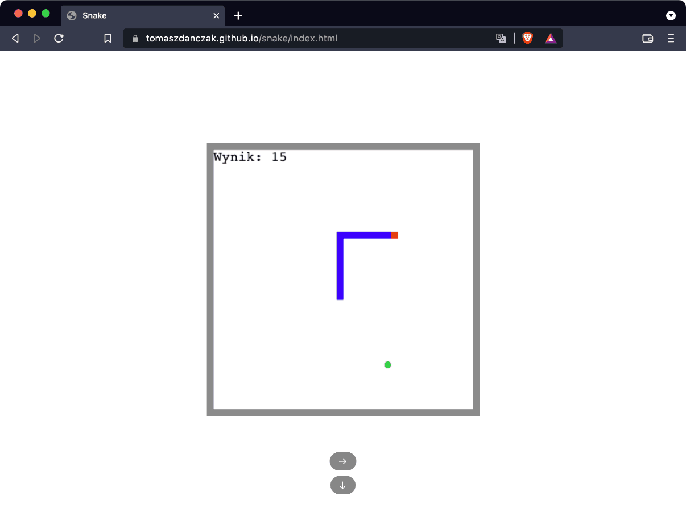

# 🌱 Snake Game

## See [Live 🚀](https://tomaszdanczak.github.io/snake/index.html)   
## About
Snake Game built using [JavaScript for Kids](https://nostarch.com/javascriptforkids)

## Things I did myself
- I split the code into files (I had to do refactoring in classes)
- I used `key` instead deprecated `keyCode` (I did refactoring of code)
- In my version head of snake has red color
